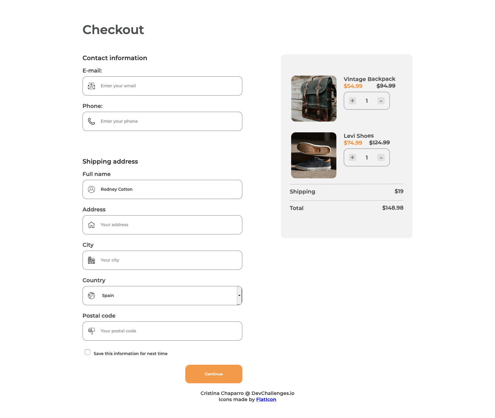
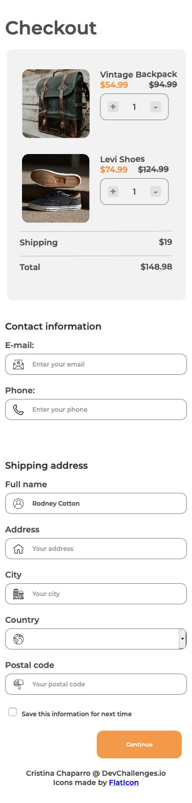

<!-- Please update value in the {}  -->

<h1 align="center">Checkout Site</h1>

   Solution for a challenge from  <a href="http://devchallenges.io" target="_blank">Devchallenges.io</a>.

  <h3>
    <a href="https://checkout-site.vercel.app/">
      Demo
    </a>
     | 
    <a href="https://github.com/nofsys/checkout-site">
      Solution
    </a>
     | 
    <a href="https://devchallenges.io/challenges/0J1NxxGhOUYVqihwegfO">
      Challenge
    </a>
  </h3>

<!-- TABLE OF CONTENTS -->

## Table of Contents

- [Overview](#overview)
  - [Built With](#built-with)
- [Features](#features)
- [Contact](#contact)
- [Acknowledgements](#acknowledgements)

<!-- OVERVIEW -->

## Overview

</img>
</img>

I chose this project because I think it's very useful to know how to build a checkout site nowadays. It's one of the type of sites we see and use the most, and almost every website that offers a service has one. Therefore, I think it could be very useful for me to learn how to create one. The next step will be learning how to add JS to it so that it works properly! But that's for another project.

The biggest challenge for me was learning how to create the buttons in the cart. I struggled a lot with that particular part and it took me hours to figure out the structure.

Then I also had to learn how to work with the text boxes, inserting placeholder text and styling it, and inserting svg icons. I also had a bit of a struggle with the two sections of the site and trying to make them stay where I wanted them to be.

What I've learned is that I have to stop fearing divs and classes. I have to create as many divs and classes as I need in order to move elements around as I need them to.

### Built With

<!-- This section should list any major frameworks that you built your project using. Here are a few examples.-->

HTML and CSS
JS in the future!

## Features

<!-- List the features of your application or follow the template. Don't share the figma file here :) -->

This application/site was created as a submission to a [DevChallenges](https://devchallenges.io/challenges) challenge. The [challenge](https://devchallenges.io/challenges/0J1NxxGhOUYVqihwegfO) was to build an application to complete the given user stories.

## Acknowledgements

<!-- This section should list any articles or add-ons/plugins that helps you to complete the project. This is optional but it will help you in the future. For exmpale -->

- SVG icons: https://www.flaticon.es/

## Contact

- GitHub [@nofsys](https://github.com/nofsys)
- Twitter [@nofsys](https://{twitter.com/nofsys})
